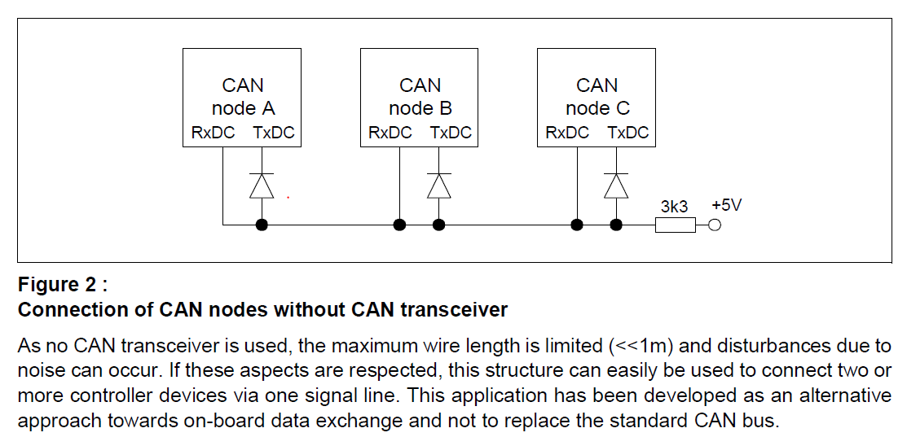

# Patroclus

Wirelessifying a VE.CAN energy meter.

Tap the internal CAN bus and very convenient mains-powered 5V of a Victron MV-3P75CT 3-phase mains power meter with an ESP32 and publish the measurements as one or more virtual meters to Venus OS via MQTT.

This code would work as well with an external VE.CAN connection if a transceiver is added to the ESP32 and it's powered separately.

## Status

**Working:**
- CAN protocol decode for voltage, current, power, frequency
- MQTT publishing to Venus OS via dbus-mqtt-devices
- Flexible phase-to-meter mapping (mix-and-match physical phases into virtual meters)
- HTTP OTA firmware updates
- Remote MQTT command interface
- Remote CAN capture streaming

**Not Yet Implemented:**
- Energy accumulation (kWh registers)
- Power factor

## Hardware

### Components

- **Seeed Studio XIAO ESP32-S3** - Main controller
- **Victron MV-3P75CT** - 3-phase energy meter with VE.CAN output
- **2× 1N4148** (or similar small signal diode) - For single-wire CAN bus
- **1× 3.3kΩ resistor** - Bus pull-up
- Fine wire for connections (keep <<1m total)

### Modification Overview

The MV-3P75CT has a **TCAN1042V** CAN transceiver on an IO daughterboard that connects into the base PCB at 90deg. We **remove the transceiver** and wire the ESP32's TWAI peripheral directly to the meter MCU's CAN TX/RX lines. This gives us a 3.3V logic-level connection without needing our own transceiver.

### 10x2 Daughterboard Connector

The IO daughterboard is soldered into the base board with a 10x2 90-deg pin header and carries the CAN tx and rx lines from the micro:

```
Viewed on top of IO board

        1   2   3   4   5   6   7   8   9  10
      ┌───┬───┬───┬───┬───┬───┬───┬───┬───┬───┐
      │   │5V │TXD│RXD│   │   │   │   │   │   │  (towards base PCB)
      ├───┼───┼───┼───┼───┼───┼───┼───┼───┼───┤
      │GND│   │   │   │   │   │   │   │   │GND│  (away from base PCB)
      └───┴───┴───┴───┴───┴───┴───┴───┴───┴───┘
```

**TXD/RXD naming:** These are from the meter MCU's perspective.

### 10x1 Power Header

Just above the 10x2 connection on the base PCB is an **unpopulated 10x1 header**. This provides a convenient power tap:

```
Viewed from the I/O side of the base board:

        1   2   3   4   5   6   7   8   9  10
      ┌───┬───┬───┬───┬───┬───┬───┬───┬───┬───┐
      │5V │   │   │GND│   │   │   │   │   │   │
      └───┴───┴───┴───┴───┴───┴───┴───┴───┴───┘
```

### Single-Wire CAN Circuit

Without transceivers, we use a single shared wire with diodes on each TXD line and a pull-up resistor. This creates the wired-AND behavior and read-while-write capability that CAN requires:

```
                            3V3
                            ┌┴┐
                            │ │ 3k3
                            └┬┘
        ┌───────┐            │            ┌──────┐
        │    TXD├──|<──┬─────┴─────┬──>|──┤TXD   │
        │       │      │           │      │      │
        │    RXD├──────┘           └──────┤RXD   │
        └───────┘                         └──────┘
        Meter MCU                         ESP32-S3

        ->|-  = 1N4148 or similar small signal diode (cathode to micro)
```

The diodes allow any node to pull the bus low (dominant) while the 3.3kΩ pull-up holds it high (recessive) when idle.

**Wire length must be <<1m** - without differential signaling, noise immunity is limited.



### Wiring

| Meter (10x2) | Signal   | Connection  | Notes            |
|--------------|----------|-------------|------------------|
| Top-3 (TXD)  | Meter TX | Diode → Bus | Cathode to micro |
| Top-4 (RXD)  | Meter RX | Bus direct  | Shared bus wire  |
| Bottom-1     | GND      | GND         | Common ground    |

| ESP32-S3   | Signal   | Connection  | Notes            |
|------------|----------|-------------|------------------|
| GPIO1 (D0) | ESP32 TX | Diode → Bus | Cathode to micro |
| GPIO2 (D1) | ESP32 RX | Bus direct  | Shared bus wire  |
| GND        | GND      | GND         | Common ground    |

| Bus     | Component     | Notes                         |
|---------|---------------|-------------------------------|
| Pull-up | 3.3kΩ to +3V3 | Holds bus recessive when idle |

| Meter (10x1) | Signal | ESP32-S3 Pin | Notes |
|--------------|--------|--------------|-------|
| Pin 1 | 5V | 5V | Power input |
| Pin 4 | GND | GND | Common ground |

### Power Options

1. **From meter's 10x1 header** - Pin 1 (5V) and Pin 4 (GND). Add 220-330µF cap for stability.
2. **USB** - For development/debugging

### Physical Installation

The ESP32 fits inside the meter enclosure. Route wires to avoid high-voltage areas(above the I/O board). The meter's CT connections and mains terminals carry lethal voltage.

```
┌────────────────────────────────────────────────┐
│ [CT1] [CT2] [CT3]                              │ 
│                                                │
│  MV-3P75CT Meter                               │
│                                                │
│  ┌─────────┐                                   │
│  │   MCU   │                                   │
│  └────┬────┘                                   │
│       │                                        │
│  ┌────┴────┐               ┌──────────────┐    │
│  │  10x2   │               │   ESP32-S3   │    │
│  │ (no CAN │               │              │    │
│  │  xcvr)  │      bus      │              │    │
│  │   TXD ──┼──|◄─┬─┬─┬─►|──┼── D0 (GPIO1) │    │
│  │   RXD ──┼─────┘ │ └─────┼── D1 (GPIO2) │    │
│  └─────────┘       │       │              │    │
│  ┌─────────┐     [3k3]     │              │    │
│  │  10x1   │       └───────┼── 3V3        │    │
│  │    5V ──┼───────────────┼── 5V         │    │
│  │   GND ──┼───────────────┼── GND        │    │
│  └─────────┘               └──────────────┘    │
│                                                │
│                            [N] [L1] [L2] [L3]  │
└────────────────────────────────────────────────┘

►|  = diode (cathode toward micro)
|◄  = diode (cathode toward micro)
[3k3] = 3.3kΩ pull-up resistor
```

## CAN Protocol

The meter broadcasts at 250 kbps using 29-bit extended CAN IDs. Source address is 0x40.

### Message Format

All messages are 8 bytes:
```
[seq_lo] [seq_hi] [val1_lo] [val1_hi] [val2_b0] [val2_b1] [val2_b2] [val2_b3]
  0        1         2         3         4         5         6         7
```

- Bytes 0-1: Sequence number (little-endian, increments each message)
- Bytes 2-3: Value 1 (16-bit, little-endian)
- Bytes 4-7: Value 2 (32-bit, little-endian, signed for power)

### Message IDs

| CAN ID     | Phase | Value 1      | Value 2                    |
|------------|-------|--------------|----------------------------|
| 0x19F30340 | L1    | Voltage × 10 | Frequency × 10 (bytes 6-7) |
| 0x19F30440 | L2    | Voltage × 10 | Frequency × 10 (bytes 6-7) |
| 0x19F30540 | L3    | Voltage × 10 | Frequency × 10 (bytes 6-7) |
| 0x19F30040 | L1    | Current × 10 | Power (W, signed)          |
| 0x19F30140 | L2    | Current × 10 | Power (W, signed)          |
| 0x19F30240 | L3    | Current × 10 | Power (W, signed)          |

Power sign: Negative = importing (consuming), Positive = exporting. Ensure your CT is oriented the correct direction.

## Configuration

Edit `include/patroclus_config.h` for shared hardware/network settings, features, and
timings. The per-board identity and physical→virtual meter mapping live in each app
(see [Instances](#instances-apps)), not here.

Add your secret config vars to `include/secrets.h`, it is excluded by `.gitignore`.

### WiFi & MQTT

`include/config.h`:
```c
#define WIFI_SSID "your_ssid"
#define MQTT_SERVER "venus.local"
```

`include/secrets.h`:
```c
#define WIFI_PASS "your_password"
#define MQTT_PASS "1234567"
```

## Instances (apps)

One codebase flashes multiple physically-distinct boards. The generic firmware —
CAN decode, WiFi, MQTT, the gx-projector contract, the publish loop, OTA, LED, and
commands — lives in `lib/PatroclusRuntime`. Each board is a thin **app** under
`src/apps/<name>/app.cpp` that names its identity and composes its physical→virtual
meter mapping through the runtime API, then drives it. The build env selects which app
compiles (`build_src_filter` in `platformio.ini`), mirroring the composition split used
by the sibling switchy/hypnos projects.

| App (`-e`) | Client id | Board meter CTs | Virtual meters |
|------------|-----------|-----------------|----------------|
| `split_phase` | `patroclus01` | L1 + L2 legs of the transfer-switch input | `grid_shore` (2-phase `grid`) |
| `inverter` | `patroclus02` | inverter input conductor + output bus | `inv_input` (`grid`), `inv_output` (`acload`) |

An app composes meters like this (`src/apps/split_phase/app.cpp`):

```cpp
#include "Runtime.h"
using namespace patroclus;
static Runtime rt;

void setup() {
    rt.setIdentity("patroclus01");
    rt.addMeter("grid_shore", "Shore Power", "grid")
        .mapPhase(0, 0)   // virtual L1 <- physical CT 0
        .mapPhase(1, 1);  // virtual L2 <- physical CT 1
    rt.begin();
}
void loop() { rt.loop(); }
```

`mapPhase(virtualLeg, physicalCt)` is the direct-copy case. For derived/composite
values (e.g. subtracting an inverter's charge draw for correct GX accounting), a meter
can instead take a computed projection via `setProjection(fn)` — see the plan's
accounting notes and `lib/PatroclusRuntime/src/VirtualMeter.h`.

To add a board: drop a new `src/apps/<name>/app.cpp` and a matching `[env:<name>]` in
`platformio.ini`.

## Building

Requires PlatformIO.

```bash
nix develop                 # dev shell with platformio
pio run -e split_phase      # build patroclus01
pio run -e inverter         # build patroclus02
```

### Upload

**USB (initial flash):**
```bash
pio run -e split_phase -t upload      # or -e inverter
```

**HTTP OTA (remote):**
```bash
pio run -e split_phase_ota -t upload  # POSTs to patroclus01.local:8080
pio run -e inverter_ota -t upload     # POSTs to patroclus02.local:8080
```

**Manual OTA:**
```bash
curl -X POST -F "firmware=@.pio/build/split_phase/firmware.bin" http://patroclus01.local:8080/update
```

Or open `http://patroclus01.local:8080/` in a browser for the upload form.

## MQTT Interface

### Topics

| Topic | Direction | Description |
|-------|-----------|-------------|
| `device/patroclus/Status` | Out | Registration with dbus-mqtt-devices |
| `device/patroclus/DBus` | In | Registration response |
| `device/patroclus/Proxy` | Out | Meter data to Venus OS |
| `device/patroclus/Command` | In | Remote commands |
| `device/patroclus/Log` | Out | Command responses, status |
| `device/patroclus/Capture` | Out | CAN frame stream (when enabled) |

### Commands

Publish to `device/patroclus/Command`:

| Command | Description |
|---------|-------------|
| `STATUS` | Show device status, phase readings, registration state |
| `CANDUMP` | Toggle serial CAN frame output |
| `CAPTURE` | Toggle MQTT CAN frame streaming |
| `REBOOT` | Restart device |
| `HELP` | List commands |

### Monitoring

```bash
# Subscribe to all patroclus topics
mosquitto_sub -h venus.local -p 8883 --insecure -t 'device/patroclus/#'

# Send a command
mosquitto_pub -h venus.local -p 8883 --insecure -t 'device/patroclus/Command' -m 'STATUS'
```

## Venus OS Integration

The device registers with [dbus-mqtt-devices](https://github.com/freakent/dbus-mqtt-devices) as grid meter(s). After registration, meters appear in the Venus OS device list and VRM portal.

Each virtual meter publishes:
- `Ac/L1/Voltage`, `Ac/L1/Current`, `Ac/L1/Power`, `Ac/L1/Energy/Forward`, `Ac/L1/Energy/Reverse`
- (Same for L2, L3 if mapped)
- `Ac/Power` (sum of all phases)
- `Ac/Energy/Forward`, `Ac/Energy/Reverse` (totals)
- `Ac/Frequency`

## Troubleshooting

There is extensive operational logging and information commands on the USB serial port: `pio device monitor`.

## License

MIT
